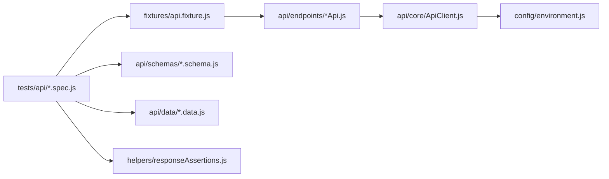

# Automação API — JSONPlaceholder | Playwright

[](https://github.com/AzraelMartins/qa-automation-playwright/actions/workflows/playwright.yml)
[](https://nodejs.org/)
[](https://playwright.dev/)

Repositório de **automação de testes de API** com [Playwright Test](https://playwright.dev/docs/api-testing) e JavaScript. A API sob teste é a [JSONPlaceholder](https://jsonplaceholder.typicode.com/) (ambiente público de demonstração).

**Autor:** [Azrael Martins](https://github.com/AzraelMartins)

---

## Visão geral

| Item | Descrição |
|------|-----------|
| **Objetivo** | Validar contratos HTTP (status, JSON e regras mínimas de negócio) |
| **Cliente HTTP** | `request` do Playwright (sem browser) |
| **Organização** | Camadas: config → client → endpoints → schemas/dados → specs |

---

## Arquitetura



| Camada | Pasta / arquivo | Responsabilidade |
|--------|-----------------|-------------------|
| **Spec** | `tests/api/` | Cenário em português, orquestra chamadas e asserções |
| **Fixture** | `fixtures/api.fixture.js` | Injeta `ApiClient` e APIs de domínio no `test` |
| **Endpoint** | `api/endpoints/` | Métodos por recurso; retorna `{ response, body }` |
| **Client** | `api/core/ApiClient.js` | GET/POST/PUT/DELETE, headers e URL absoluta |
| **Schema** | `api/schemas/` | Validação de contrato do JSON |
| **Dados** | `api/data/` | IDs fixos e payloads de teste |
| **Config** | `config/environment.js` | `API_BASE_URL` (e futuras variáveis) |
| **Helpers** | `helpers/` | Asserções HTTP reutilizáveis |

O `baseURL` em [`playwright.config.js`](playwright.config.js) (project `api`) alinha o contexto do Playwright; o `ApiClient` monta URLs absolutas para logs e mensagens de falha mais claras.

---

## Convenções

### Idioma

- **Português:** títulos dos testes, README e comentários quando necessário.
- **Inglês:** classes, métodos e nomes de arquivos de código (`PostsApi`, `listPosts`, `posts.schema.js`).

### Nomes de arquivo

| Tipo | Padrão | Exemplo |
|------|--------|---------|
| Spec | `tests/api/<recurso>/<acao>-<recurso>.spec.js` | `consultar-posts.spec.js` |
| Endpoint | `api/endpoints/<Recurso>Api.js` | `PostsApi.js` |
| Schema | `api/schemas/<recurso>.schema.js` | `posts.schema.js` |
| Dados | `api/data/<recurso>.data.js` | `posts.data.js` |

### Regras rápidas

- URLs e ambiente **somente** em `config/` (via `.env`), nunca hardcoded nos specs.
- Endpoints **não** validam contrato; isso fica em **schemas** chamados pelos specs.
- Novos domínios (`CommentsApi`, etc.): registrar fixture em `fixtures/api.fixture.js` no mesmo arquivo até o projeto crescer bastante.

---

## Camadas de asserção

Use na ordem que fizer sentido para o cenário:

1. **`expectOkJson(response, 200)`** — status HTTP explícito (padrão `200`) e `Content-Type` JSON ([`helpers/responseAssertions.js`](helpers/responseAssertions.js)). Para POST com `201`, passe o segundo argumento: `expectOkJson(response, 201)`.
2. **`expectStatus(response, 404)`** — quando o foco é só o código HTTP, sem validar JSON.
3. **Schema** (`postListSchema`, `postSchema`) — formato e campos obrigatórios do corpo.
4. **`expect(body.campo)`** — regra de negócio específica (ex.: `body.id === existingPostId`).

Referência: [`tests/api/posts/consultar-posts.spec.js`](tests/api/posts/consultar-posts.spec.js).

---

## Como adicionar um cenário ou recurso

Use **posts** como modelo. Checklist:

1. **Endpoint** — em `api/endpoints/`, classe `*Api` com métodos que chamam `this.client` e retornam `{ response, body }`.
2. **Schema** — funções `*Schema` em `api/schemas/`; lançar `Error` com mensagem clara se o contrato falhar.
3. **Dados** — constantes e payloads em `api/data/`.
4. **Fixture** — em `fixtures/api.fixture.js`, `extend` com `nomeApi: async ({ apiClient }, use) => ...`.
5. **Spec** — pasta `tests/api/<recurso>/`, `test.describe` opcional, título em PT.
6. **Validar** — `npm test`.

Exemplo de fluxo para **comentários** (futuro): `CommentsApi` → `comments.schema.js` → `comments.data.js` → fixture `commentsApi` → `consultar-comments.spec.js`.

---

## Stack

| Tecnologia | Uso |
|------------|-----|
| Node.js LTS | Runtime |
| Playwright Test | Runner e cliente HTTP |
| dotenv | Variáveis em `.env` |

---

## Setup

```bash
npm ci
cp .env.example .env   # opcional; há default em config/environment.js
```

| Variável | Obrigatória | Default |
|----------|-------------|---------|
| `API_BASE_URL` | Não | `https://jsonplaceholder.typicode.com` |

---

## Executar testes

```bash
npm test
npm run test:api
npm run report    # relatório HTML
```

---

## Estrutura do repositório

```text
.
├── api/
│   ├── core/ApiClient.js
│   ├── endpoints/PostsApi.js
│   ├── data/posts.data.js
│   └── schemas/posts.schema.js
├── config/environment.js
├── fixtures/api.fixture.js
├── helpers/responseAssertions.js
├── tests/api/posts/consultar-posts.spec.js
├── playwright.config.js
├── package.json
└── .github/workflows/playwright.yml
```

---

## CI

Workflow [`.github/workflows/playwright.yml`](.github/workflows/playwright.yml): `npm ci` → `npm test` → artifact `playwright-report` (30 dias). Não instala browsers (suite só API).

---


---

## Licença

[ISC](package.json)
